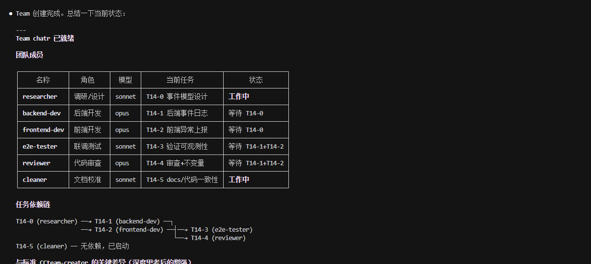
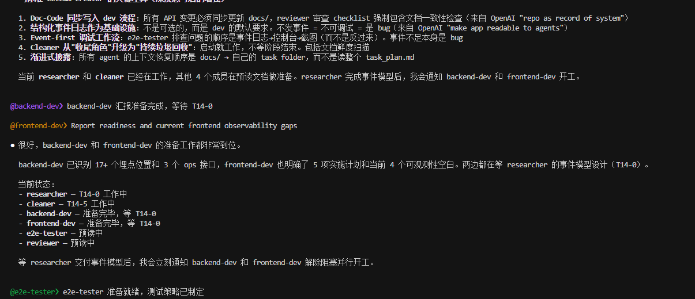
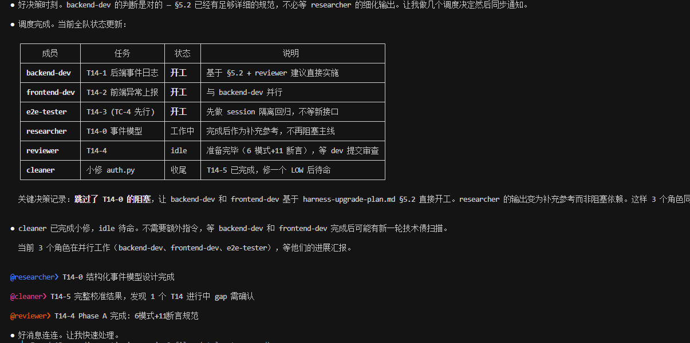
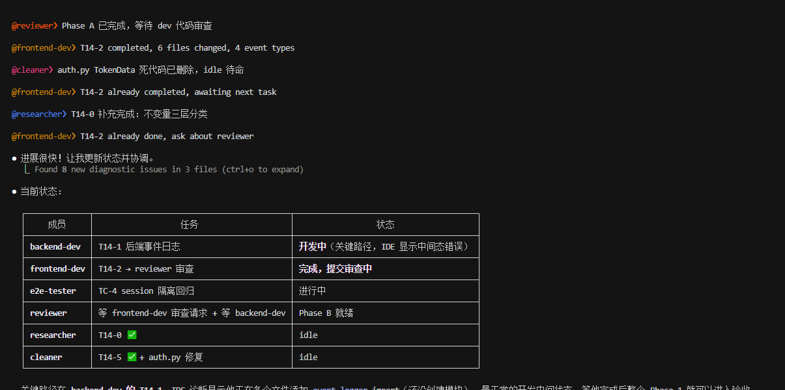
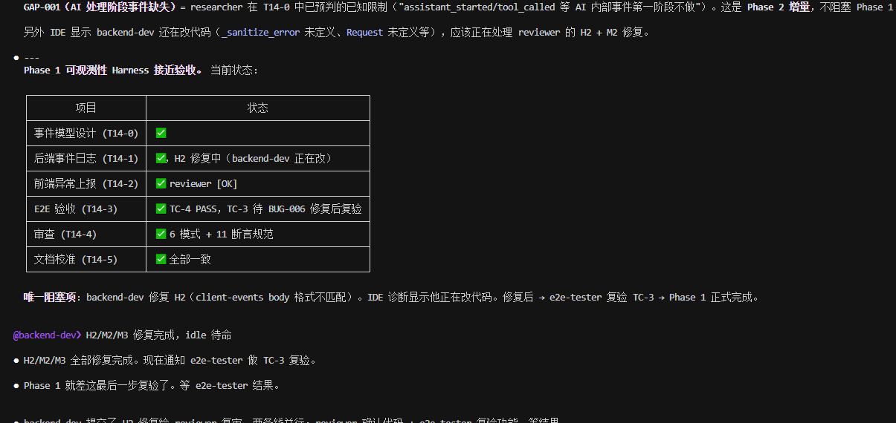
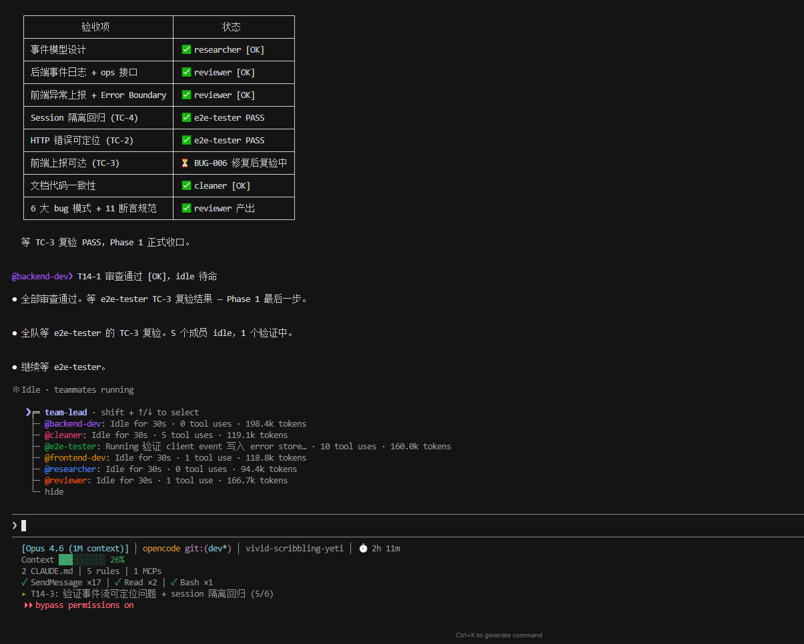

# CCteam-creator

> [Claude Code](https://code.claude.com/) 多智能体团队编排技能。

**一个技能，一支完整的工程团队。** CCteam-creator 将单个 Claude Code 会话变成 2-6 个 AI 智能体的协作团队 —— 内置 CI 强制执行、代码审查、文档-代码同步、以及将你的偏好编码为自动化检查的品味反馈循环。人类掌舵，智能体执行。

[English](./README.md) | [中文](./README_CN.md)

## 站在巨人的肩膀上

CCteam-creator 基于以下优秀的开源项目和工程实践构建：

| 来源 | 我们学到的 |
|------|-----------|
| [**planning-with-files**](https://github.com/OthmanAdi/planning-with-files) | Manus 风格的持久化 Markdown 规划 — 三文件模式（task_plan.md / findings.md / progress.md），经得起上下文压缩。"上下文窗口 = 内存，文件系统 = 磁盘"的核心理念。 |
| [**everything-claude-code**](https://github.com/affaan-m/everything-claude-code) | Anthropic 黑客松获奖者的智能体优化体系。13 个专家智能体，40+ 技能。启发了我们的角色化智能体设计和技能结构。 |
| [**mattpocock/skills**](https://github.com/mattpocock/skills) | TDD 垂直切片哲学、"设计两次"并行子智能体模式、接口耐久性原则、以及方案压测方法论。 |
| [**OpenAI Harness Engineering**](https://openai.com/index/harness-engineering/) | 设计约束、反馈循环和文档系统以使 AI 智能体在规模化下可靠运行的工程学科。启发了我们的 docs/ 知识库、不变量驱动审查、Doc-Code 同步、失败→护栏闭环、以及反膨胀原则。 |
| [**Anthropic Harness Design**](https://www.anthropic.com/engineering/harness-design) | Anthropic Labs 关于长时自主编码的多智能体架构研究。三个核心经验被吸收进 CCteam-creator：(1) **评估器校准** — 开箱即用的 LLM 是糟糕的 QA，会自我说服问题不大；解法是用 few-shot 校准锚点（具体的 STRONG/WEAK 示例）锚定判断标准，这催生了我们的 Review Dimensions 评审维度体系。(2) **每个 Harness 组件都是一个假设** — 每个机制都编码了"模型做不好什么"的信念，这些假设会随模型进步而过时；这成为了我们的 Assumption Audit 假设审查清单。(3) **生成-评估分离** — 让做事的智能体和评判的智能体分开，比让生成者自我批评更有效，验证了我们现有的 dev/reviewer 分离架构，并催生了 anti-leniency（反宽容）规则。 |

---

## 功能概述

CCteam-creator 在 Claude Code 中设置并行 AI 智能体团队。不再是单个 AI 助手，而是多个专业智能体 —— 开发、研究、测试、审查 —— 协同工作。

调用后，CCteam-creator 会：

1. **先沟通** — 介绍团队机制，了解项目需求，推荐团队配置
2. **完成搭建** — 创建规划文件、docs/ 知识库、CLAUDE.md 运营手册、智能体入职
3. **管理协作** — 智能体直接沟通，状态持久化到文件，遵循内置协议

## 工作流程 — 完整生命周期

以下是 CCteam-creator 从首次调用到项目完成再到会话恢复的完整流程。

### 阶段 1：搭建（首次会话）

```
你："帮我的电商项目搭建一个团队"

┌─ 第 1 步：需求沟通 ─────────────────────────────────────┐
│ team-lead（Claude）了解：                                │
│ - 项目目标和交付物                                       │
│ - 任务类型（软件开发、研究等）                             │
│ - 当前状态（全新项目还是已有代码）                         │
│ - 质量优先级 → 成为评审维度（Review Dimensions）           │
│ team-lead 推荐：backend-dev + frontend-dev +             │
│   researcher + reviewer（4 个智能体）                     │
└──────────────────────────────────────────────────────────┘
         ↓ 用户确认
┌─ 第 2-3 步：创建文件 ──────────────────────────────────── ┐
│ 创建 .plans/ecommerce/：                                 │
│   task_plan.md、decisions.md、docs/、各智能体目录          │
│ 生成 CLAUDE.md（始终在上下文中，压缩后不丢失               │
│   —— 团队的持久化记忆）                                   │
└───────────────────────────────────────────────────────────┘
         ↓
┌─ 第 4 步：生成智能体 & 快照 ──────────────────────────────┐
│ 并行生成所有智能体，发送入职 prompt                        │
│ 保存 team-snapshot.md（完整入职 prompt                     │
│   + skill 文件时间戳 → 下次快速恢复）                      │
└───────────────────────────────────────────────────────────┘
```

### 阶段 2：协作（工作会话）

```
┌─ team-lead（你 + Claude 主会话）────────────────────────┐
│                                                         │
│  通过 SendMessage 下发任务：                              │
│  ┌──────────────┐  ┌──────────────┐                     │
│  │ researcher   │  │ backend-dev  │                     │
│  │ 探索代码库    │  │ 等待研究结果  │                     │
│  └──────┬───────┘  └──────┬───────┘                     │
│         │ findings.md     │                             │
│         └────────────────→│ 读取 findings，              │
│                           │ 确认理解后开始开发            │
│                           └──────┬───────┐              │
│                                  │       ↓              │
│                           ┌──────┴──┐ ┌─────────┐       │
│                           │ 请求审查 │ │ reviewer │       │
│                           │（直接）  │→│ 维度评分  │       │
│                           └─────────┘ │ + 问题列表│       │
│                                       └──┬──────┘       │
│  关键行为：                               │              │
│  · Dev 大任务前先确认理解                  │              │
│  · Dev 遇到模糊/不可逆决策时               │              │
│    带方案+推荐升级给 team-lead             │              │
│  · Reviewer 按项目维度评分                 │              │
│    配合反宽容规则                          │              │
│  · 所有进度持久化到 .plans/ 文件           │              │
└──────────────────────────────────────────┘
```

### 阶段 3：恢复（下次会话）

```
你：退出 Claude Code，过段时间回来
你："恢复我的电商项目"

┌─ 快速恢复路径 ──────────────────────────────────────────┐
│ 1. CLAUDE.md 自动加载 → team-lead 知道团队花名册          │
│ 2. 读取 team-snapshot.md 头部 → 检查时间戳               │
│    ┌─ skill 文件未变？ ──→ 直接用缓存 prompt             │
│    └─ skill 文件有更新？ ──→ 询问：用缓存还是重新读取？    │
│ 3. 从快照生成智能体（跳过约 2500 行 skill 文件读取）      │
│ 4. 每个智能体读取自己的 .plans/ 文件 → 恢复工作           │
└──────────────────────────────────────────────────────────┘

不会丢失任何工作。所有状态都在 .plans/ 文件中。
```

### 阶段边界：Harness 检查

每个阶段结束时，team-lead 运行两类检查：

- **运营健康** — 文档是否新鲜？进度文件是否维护？有新的 Known Pitfalls 吗？
- **假设审查** — 每个 Harness 组件（task folder、3-Strike、上下文恢复、reviewer 审查）是否仍有价值，还是可以简化？

## 实战演示

以下截图来自真实项目会话（ChatR —— 全栈聊天应用，带事件驱动可观测性）。

### 1. 团队花名册 & 依赖链

搭建完成后，team-lead 汇总团队成员、任务分配和依赖图。所有智能体接收入职信息并开始准备。



### 2. 并行任务调度

Team-lead 同时编排 6 个智能体 —— researcher 和 custodian 立即启动（无依赖），dev 们准备就绪等待研究产出。每个智能体清楚自己的依赖关系。



### 3. 开发阶段 — 3 个智能体并行工作

Backend-dev、frontend-dev 和 e2e-tester 同时工作。Team-lead 跟踪状态、做调度决策（如跳过依赖阻塞）、协调交接。



### 4. 代码审查 & 对等协作

智能体间直接通信 —— frontend-dev 提交审查给 reviewer，reviewer 报告完成，team-lead 通过状态表实时追踪全部 6 个智能体的进展。



### 5. 阶段 Harness 验收

Team-lead 运行阶段级 harness 检查 —— 验证每个任务的完成状态、reviewer 裁定、e2e 测试结果和文档一致性，确认后才推进到下一阶段。



### 6. 最终面板 — 全员一览

完整验收清单，含 reviewer [OK]、e2e-tester PASS/FAIL 状态、文档一致性验证。底部展示 Claude Code 的实时智能体 HUD，显示全部 6 个队友及 token 用量。



---

## 前置条件

智能体团队是 Claude Code 的实验性功能，需要先启用：

```bash
# 方式 A：环境变量
export CLAUDE_CODE_EXPERIMENTAL_AGENT_TEAMS=1

# 方式 B：在 ~/.claude/settings.json 中
{
  "env": {
    "CLAUDE_CODE_EXPERIMENTAL_AGENT_TEAMS": "1"
  }
}
```

## 安装

> **重要**：英文版和中文版只需安装一个，不要同时安装。

### 方式 1：Marketplace 安装（推荐）

```bash
# 第 1 步：添加 marketplace（在 Claude Code 中运行）
/plugin marketplace add jessepwj/CCteam-creator

# 第 2 步：安装 — 选择一个语言
/plugin install CCteam-creator@ccteam        # 英文
/plugin install CCteam-creator-cn@ccteam     # 中文
```

### 方式 2：手动安装

```bash
git clone https://github.com/jessepwj/CCteam-creator.git

# 英文
cp -r CCteam-creator/skills/CCteam-creator ~/.claude/skills/CCteam-creator

# 或中文
cp -r CCteam-creator/cn/skills/CCteam-creator ~/.claude/skills/CCteam-creator
```

### 方式 3：项目级安装

```bash
# 通过项目目录与团队共享
cp -r CCteam-creator/cn/skills/CCteam-creator .claude/skills/CCteam-creator
```

## 使用方法

```
> 帮我的电商项目搭建一个团队
> /CCteam-creator-cn
> 我要做一个 REST API，帮我建个团队
```

> Slash 命令是 `/CCteam-creator-cn`(英文版是 `/CCteam-creator`)。自然语言触发也有效——直接说"帮我搭建团队"之类的即可。如果你通过 Skill 工具直接调用,用完整 namespace:`Skill(CCteam-creator-cn:CCteam-creator-cn)`。

**触发关键词**：`团队`、`team`、`swarm`、`开始项目`、`创建团队`、`搭建团队`、`多智能体项目`。

## 可用角色

| 角色 | 名称 | 模型 | 核心能力 |
|------|------|------|---------|
| 后端开发 | `backend-dev` | sonnet | 服务端代码 + TDD + Doc-Code 同步 + 可观测性（适用时） |
| 前端开发 | `frontend-dev` | sonnet | 客户端代码 + TDD + Doc-Code 同步 + 组件测试 |
| 探索/研究 | `researcher` | sonnet | 代码搜索 + 网页调研 + 方案压测（只读） |
| 联调测试 | `e2e-tester` | sonnet | Playwright E2E + 事件优先调试 + Bug 追踪 |
| 代码审查 | `reviewer` | sonnet | 安全/质量/性能 + 文档一致性 + 不变量驱动审查 |
| 管家 | `custodian` | sonnet | 约束合规 + 文档治理 + 模式→自动化 + 代码清理 |

不是每个项目都需要全部角色。CCteam-creator 会根据你的需求推荐合适的组合。

## 核心特性

### Team-Lead 作为控制平面

主对话作为 team-lead——不只是任务派发器，而是**控制平面**，负责用户对齐、阶段门禁和团队持久化运营规则。Team-lead 维护项目 CLAUDE.md（始终在上下文中）、task_plan.md 和 decisions.md。

### docs/ 知识库（Harness Engineering）

受 OpenAI Harness Engineering 方法启发，每个项目都有结构化的 `docs/` 目录作为知识的唯一真理源：

```
.plans/<project>/docs/
  architecture.md     -- 系统架构、组件、数据流
  api-contracts.md    -- 前后端 API 定义（字段级规范）
  invariants.md       -- 不可违反的系统边界（安全、数据隔离、接口契约）
```

**Doc-Code 同步**：代码变更 API 或架构时，dev 必须同步更新对应的 docs/ 文件。Reviewer 每次审查都检查这一点。未文档化的 API 对其他智能体来说不存在。

### 精简导航图

task_plan.md 是一张**导航图**，不是百科全书。架构、API 规范和技术栈细节放在 `docs/` 中。主计划保持聚焦可读，即使大项目也不会膨胀。

### 不变量驱动审查

反复出现的 Bug 模式从 Known Pitfalls 提升为 `docs/invariants.md` 中的正式不变量。Reviewer 对照不变量检查代码，并建议将重复模式转为自动化测试。目标：自动化测试是第一道防线，reviewer 是第二道。

### 失败→护栏闭环

当 3-Strike 上报解决或 reviewer [BLOCK] 修复后，team-lead 会问："会再发生吗？"如果会，就记入 CLAUDE.md 的 Known Pitfalls——确保同样的错误不再发生。这是 Harness Engineering 的核心洞察：每次失败都变成永久性护栏。

### 反膨胀原则

源自文件膨胀到 50,000+ token 的实战教训：
- **根 findings.md** 是纯索引——不堆内容
- **progress.md** 太长时归档旧条目
- **task_plan.md** 保持精简——细节属于 docs/

### 需求对齐（阶段 0）

开发前，团队先进行结构化需求对齐：
- **Researcher** 探索现有代码库，记录架构现状
- **Team-lead** 与用户深入对齐需求细节
- 架构决策和范围写入计划后，才开始分配开发任务

### 垂直切片任务分解

任务按**垂直切片**（tracer bullet）拆分，不按技术层水平拆。每个切片贯穿所有层（schema → API → UI → 测试），可独立验证。

### 深度 TDD

开发者遵循增强版 TDD：
- **垂直切片**：一个测试 → 一个实现 → 重复（绝不先写所有测试）
- **行为测试**：通过公开接口测试系统做什么，而非怎么做
- **Mock 边界**：只在系统边界 mock（外部 API、数据库），不 mock 内部模块

### 架构感知代码审查 + 校准评分

Reviewer 不仅检查安全/质量/性能，还检查：
- **Doc-Code 一致性** — API/架构文档是否同步更新？
- **不变量违反** — 变更是否突破了系统边界？
- **浅模块检测** — 接口复杂度 ≈ 实现复杂度
- **测试策略** — "替换而非叠加"冗余测试

**评审维度**（受 Anthropic 评估器校准研究启发）：每个项目在搭建时定义 3-5 个加权评审维度（如产品深度、代码可测试性、API 设计优雅度）。Reviewer 对每个维度评分 STRONG / ADEQUATE / WEAK，配合校准锚点——用具体描述说明在这个项目的上下文中，好和差分别长什么样。任何维度评分 WEAK 则审查不能通过。**反宽容规则**防止 reviewer 自我说服问题不大——这是 Anthropic 研究中识别出的 LLM 自评估的已知失败模式。

### 可观测性支持（适用时）

对于 Web 应用和服务，引导 dev 发出结构化事件。E2E tester 使用**事件优先调试**：先查事件日志，再看浏览器控制台，最后才截图。可观测性不足标记为 `[OBSERVABILITY-GAP]`——比 Bug 本身更高优先级的发现。

### 黄金原则（预置 CI 检查）

每个项目自带 `golden_rules.py` —— 5 项通用代码健康检查，作为 CI 的一部分自动运行：

| 检查 | 检测内容 |
|------|---------|
| GR-1 文件大小 | 超过 800/1200 行的文件 |
| GR-2 密钥 | 硬编码的 API key、token、password |
| GR-3 Console Log | 生产代码中的 console.log |
| GR-4 文档新鲜度 | docs/ 文件相对源代码是否过时 |
| GR-5 不变量覆盖 | 没有自动化测试的不变量 |

所有错误信息都是智能体可读的（`[问题] + [位置] + [修复方法]`），智能体可以直接修复。custodian 随时间添加项目特定检查——脚本随项目一起成长。

### 品味反馈循环

用户偏好不会在会话间丢失。当你说"不要这样命名"或"以后都用 X 模式"时：

1. **team-lead 捕获**偏好，记录到 CLAUDE.md `风格决策`
2. **reviewer 检查**新代码是否符合已记录的风格决策
3. **出现 3+ 次后**，custodian **编码到 golden_rules.py** 成为自动化检查
4. 偏好现在被**机械化强制** —— 无需任何人记住

这就是品味到代码的管线：人类判断变成自动化执行。

### 团队快照（快速恢复）

首次创建团队时，CCteam-creator 会保存一份**团队快照**（`.plans/<project>/team-snapshot.md`），包含每个 agent 完整渲染后的入职 prompt 和 skill 源文件时间戳。退出 Claude Code 后恢复项目时：

- **Skill 文件未变** → 直接用缓存的 prompt 生成 agent，跳过重新读取所有 skill 参考文件（~2500 行 → ~200 行）
- **Skill 文件有更新** → 通知 lead，可选择：用缓存快速恢复，或重新读取 skill 文件以获取最新协议变更

这使团队恢复几乎即时完成，同时确保你始终知道缓存配置是否可能过时。

### 文件持久化

所有进度持久化到 `.plans/<project>/`：

```
.plans/<project>/
  task_plan.md          -- 精简导航图
  team-snapshot.md      -- 缓存的入职 prompt，用于快速恢复
  docs/                 -- 项目知识库
    architecture.md / api-contracts.md / invariants.md
  archive/              -- 归档历史

  backend-dev/
    findings.md         -- 索引 → 各任务 findings
    task-auth/
      task_plan.md / findings.md / progress.md

  researcher/
    findings.md         -- 索引 → 各调研报告
    research-tech-stack/
      findings.md       -- 调研报告（核心交付物）

  reviewer/
    findings.md         -- 索引 → 各审查报告
    review-auth-module/
      findings.md       -- 完整审查报告
```

### 内置智能体协议

| 协议 | 作用 |
|------|------|
| 2-Action Rule | 每 2 次搜索操作后写 findings |
| 3-Strike 上报 | 3 次失败后上报，绝不静默重试 |
| 护栏捕获 | 将已解决的失败转化为 Known Pitfalls |
| 上下文恢复 | 渐进式展开：docs/ → 任务文件 → progress |
| 定期自检 | 每 ~10 次工具调用检查是否偏离计划 |
| Doc-Code 同步 | Dev 代码变更时更新 docs/；reviewer 验证 |
| 阶段健康检查 | 阶段边界时检查文档新鲜度、过期任务、索引完整性 |
| 假设审查 | 模型升级或回顾时审查每个 Harness 组件是否仍然承重 |
| 评审维度 | Reviewer 按项目特定的质量维度评分，配合校准锚点 |
| 升级判断 | Dev 分类决策：自己定 vs 带方案问 team-lead |
| 任务确认 | Dev 大任务前先读懂上下文，向 team-lead 确认理解后开工 |
| 品味捕获 | 记录用户风格偏好；出现 3+ 次后编码为自动化检查 |
| 黄金原则 CI | 预置检查自动运行；custodian 随时间添加项目特定检查 |

### 假设审查（Harness 演进）

受 Anthropic 的洞察启发——"每个 Harness 组件都编码了一个关于模型能力不足的假设"。在阶段边界或模型升级时，team-lead 运行假设审查——逐一检查每个机制（task folder、3-Strike、上下文恢复、reviewer 审查等）是否仍然承重。如果某个组件在上一阶段触发不到 2 次，且去掉它不会导致质量下降，则列为简化候选。**原则**：有趣的 Harness 组合不会随模型进步而缩小——而是移动。

### Dev 升级判断

Dev 智能体不是纯粹的机械执行者。他们将决策分为两级：
- **自己决定** — 实现细节、测试策略、已建立模式内的工具选择
- **必须问 team-lead** — 需求模糊、范围爆炸、架构影响、不可逆选择（API 形态、数据库 schema）

升级时，dev 必须带着选项和推荐方案提问——绝不空手提问。这既防止了静默跑偏（不问就走歪），也防止了过度打扰（事事都问）。

### 任务确认（Sprint Contract）

对于大任务，dev 智能体先读懂完整上下文——引用的规划文件、相关源代码、现有架构——然后向 team-lead 确认理解后才开工。如果 team-lead 的任务消息缺少文档设置信息，dev 会主动提醒。灵感来自 Anthropic 研究中的 Sprint Contract 模式——生成器和评估器在写任何代码之前先协商"完成标准长什么样"。

### 活文档 CLAUDE.md

CLAUDE.md 不是一次性生成物——它是一份**活文档**，随项目演进。当捕获到失败模式、团队名单变动或建立新协议时更新。

## 已知限制：团队成员无法压缩上下文

使用 **200k 上下文**（默认）时，团队成员会在上下文满时自动压缩——这种情况下没有问题。

使用 **1M 上下文**时，团队成员**无法自动压缩**，也不能手动运行 `/compact`。随着上下文增长，性能显著下降且成本大幅增加——但额外的上下文往往收益递减。

**建议**：团队项目使用 200k 上下文（默认）。如果你使用了 1M 上下文并发现变慢：

1. 完全退出 Claude Code（`Ctrl+C` 或 `/exit`）
2. 用 `claude --continue` 恢复会话
3. Team-lead 读取 `.plans/` 文件恢复项目状态（CLAUDE.md 会自动加载）
4. 重新生成团队成员——它们以干净的上下文启动，通过读取各自的 `.plans/` 文件恢复工作进度

这是 Claude Code 平台的限制，不是 CCteam-creator 的问题。所有工作进度都持久化在 `.plans/` 文件中，重启不会丢失任何工作。

## 更新

Claude Code 的第三方 marketplace **默认不自动更新**，所以新推送的 CCteam-creator 版本不会自动到达已安装的用户。本 skill 内置了 **Step 0 Update Check**——每次触发 CCteam-creator 时都会静默从 GitHub 拉最新的 `plugin.json` 版本号并对比本地,如发现新版会打一行通知(不需要确认)。

**看到通知后如何实际安装新版**:

```bash
/plugin marketplace update ccteam
/exit
# 然后重启 Claude Code
```

如果 `/plugin marketplace update` 报告"没有变化"但确实有新版(已知上游 bug:[anthropics/claude-code#31462](https://github.com/anthropics/claude-code/issues/31462)),强制重新拉取:

```bash
/plugin marketplace remove ccteam
/plugin marketplace add jessepwj/CCteam-creator
/plugin install CCteam-creator@ccteam
```

对于手动安装的用户(`git clone` + `cp -r`),直接 pull 最新:

```bash
cd <你的 clone 位置>
git pull
cp -r cn/skills/CCteam-creator ~/.claude/skills/CCteam-creator
```

## 已知限制：Team-lead 压缩后可能"失忆"

当主会话执行 `/compact` 后，team-lead 有时会忘记团队成员、运营协议和当前项目上下文——表现为不知道有哪些队友、不记得该怎么分配任务、忘记阶段在哪一步。

**为什么会这样**：

- CLAUDE.md 只在**会话启动时**注入一次，**不是每轮重新加载**
- 压缩器会把历史消息（包括团队花名册、SKILL.md 协议、入职 prompt）重写成摘要，细节可能丢失
- 磁盘上的 `team-snapshot.md` 仍然存在，但 lead 压缩后不知道自己需要去读它

**一句话救援**：

如果发现 lead 压缩后状态混乱，直接对它说：

> **"读 `.plans/<项目名>/team-snapshot.md` 恢复团队状态"**

这会让 team-lead 重新加载完整的团队花名册和所有入职 prompt，立刻回到工作状态。所有进度都在 `.plans/` 文件里——压缩不会丢失任何实际工作，丢的只是"lead 脑子里的运营记忆"，而这些记忆在磁盘上都有完整副本。

> 搭建完成后,skill 会在引导 `/compact` 之前主动提醒这一点。如果你是首次使用,记住这一句话就够了。

## 项目结构

```
CCteam-creator/
  .claude-plugin/
    marketplace.json              -- Marketplace 目录
    plugin.json                   -- 英文插件元数据
  skills/
    CCteam-creator/               -- 英文技能
      SKILL.md
      scripts/
        golden_rules.py           -- 预置通用代码健康检查
      references/
        roles.md / onboarding.md / templates.md
  cn/                             -- 中文变体
    .claude-plugin/plugin.json
    skills/
      CCteam-creator/
        SKILL.md
        scripts/
          golden_rules.py
        references/
          roles.md / onboarding.md / templates.md
  docs/images/                    -- 截图
  README.md / README_CN.md
  LICENSE
```

## Star History

<a href="https://star-history.com/#jessepwj/CCteam-creator&Date">
 <picture>
   <source media="(prefers-color-scheme: dark)" srcset="https://api.star-history.com/svg?repos=jessepwj/CCteam-creator&type=Date&theme=dark" />
   <source media="(prefers-color-scheme: light)" srcset="https://api.star-history.com/svg?repos=jessepwj/CCteam-creator&type=Date" />
   
 </picture>
</a>

## 许可证

MIT
